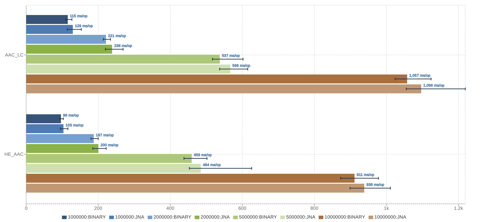

# jna-aac-encoder

[](https://github.com/sheinbergon/jna-aac-encoder/blob/master/LICENSE)
[](https://github.com/sheinbergon/jna-aac-encoder/actions?query=workflow%3Amulti-platform-ci)
[](https://github.com/sheinbergon/jna-aac-encoder/releases/latest)
[](https://search.maven.org/search?q=g:org.sheinbergon%20a:jna-aac-encoder*)
[](https://coveralls.io/github/sheinbergon/jna-aac-encoder)
[](https://app.codacy.com/manual/sheinbergon/jna-aac-encoder)

                                                                                                                                                                                                                                                                                                 
This library provides AAC encoding capabilities for the JVM. 
It utilizes the [FDK AAC](https://github.com/mstorsjo/fdk-aac) library via JNA in order to do so.

## License
**Important!** While this library uses LGPL-3, please see
the [FDK AAC license](NOTICE) for additional information
regarding re/distribution and licensing limitations.

## Usage

### Dependencies
Artifacts are available on maven central:

**_Maven_**
```xml
<dependency>
    <groupId>org.sheinbergon</groupId>
    <artifactId>jna-aac-encoder</artifactId>
    <version>0.1.7</version>
</dependency>
```

**_Gradle_**
```groovy
compile 'org.sheinbergon:jna-aac-encoder:0.1.7'
```

#### Additional information
* Single artifact containing _libfdk-aac_ shared libraries cross-compiled for:
  * Linux (64-bit) 
  * Windows (32-bit and 64-bit)
  * OSX (64-bit, compiled with Xcode 9.4.1 SDK) 
* Provided fdk-aac version is 0.1.6
* Both 0.1.5 and 0.1.6 versions were tested and found to comply with this bridge.
 
### Encoding using the JVM AudioSystem
```java
AudioInputStream input = AudioSystem.getAudioInputStream(...);
File output = new File(...);
AudioSystem.write(input, AACFileTypes.AAC_LC, output);
```

## Performance
Performance benchmarks comparing JNA to a BINARY application(`aac-enc`) are available using [JMH](http://openjdk.java.net/projects/code-tools/jmh/) and [JMH Visualizer](https://github.com/jzillmann/jmh-visualizer):



To run the benchmarks locally:
* Clone this repository onto a Linux host
* Ensure that you have `libfdk-aac.so` library installed (either from an external repository or manually compiled)
* Ensure that you have the `aac-enc` binary installed (either from an external repository or manually compiled)
* Run the following command (from within the cloned repository)
```groovy
./gradlew -b benchmark.gradle jmh jmhReport
```
* If the aac-enc binary is not installed in /usr/bin/aac-enc, you can a custom path path by adding this gradle property:
```groovy
-PaacEncBin=/CUSTOM/PATH/TO/AAC-ENC 
```
* The JMH reports can be viewed by opening `build/reports/benchmark/index.html` in your browser.

## Limitations
Currently, **_libfdk-aac_ itself** supports only the pcm_s16le WAV input format, meaning:
* Sample size - 16 bit(signed)
* WAV format - (L)PCM
* Byte order - Little Endian

While this form of input formatting seems to be the common raw-audio formatting, it's important
to note that providing input audio with different formatting will cause
the encoding process to fail. 

Additional restrictions:
* A maximum of 6 audio input/output channels
* Only the AAC-LC/HE-AAC/HE-AACv2 encoding profiles are supported  

## Roadmap
* Upgrade to fdk-aac 2.0.x
* Improved lower-level interface (with examples).
* Support for 24 bit WAV input (via conversion).
* M4A encoding.
* AAC decoding ???