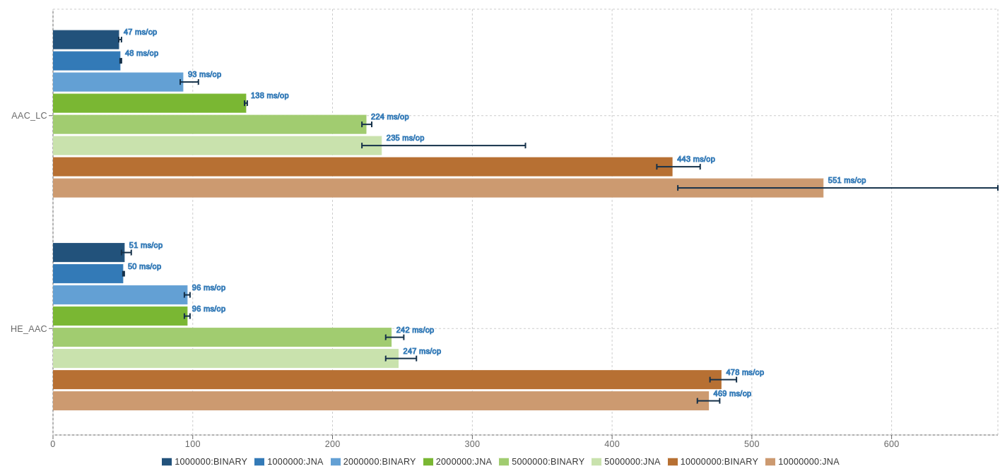

# jna-aac-encoder

[](https://github.com/sheinbergon/jna-aac-encoder/blob/master/LICENSE)
[](https://github.com/sheinbergon/jna-aac-encoder/actions?query=workflow%3A"Multi+Platform+CI")
[](https://github.com/sheinbergon/jna-aac-encoder/releases/latest)
[](https://search.maven.org/search?q=g:org.sheinbergon%20a:jna-aac-encoder*)
[](https://coveralls.io/github/sheinbergon/jna-aac-encoder)
[](https://app.snyk.io/org/sheinbergon/project/e56757ea-c9f2-45a1-8544-5083d087faf8)
[](https://app.codacy.com/manual/sheinbergon/jna-aac-encoder)
[](https://liberapay.com/sheinbergon/donate)                
                                                                                                                                                                                                                                                                                 
This library provides AAC encoding capabilities for the JVM. 
It utilizes the [FDK AAC](https://github.com/mstorsjo/fdk-aac) library via JNA in order to do so.

## License
**Important!** While this library uses LGPL-3, please see
the [FDK AAC license](NOTICE) for additional information
regarding re/distribution and licensing limitations.

## Sponsorship

Enjoying my work? A show of support would be much obliged :grin:

<a href="https://liberapay.com/sheinbergon/donate">

</a>&nbsp;&nbsp;<a href="https://www.buymeacoffee.com/sheinbergon">

</a>

## Usage

### Dependencies
Artifacts are available on maven central:

**_Maven_**
```xml
<dependency>
    <groupId>org.sheinbergon</groupId>
    <artifactId>jna-aac-encoder</artifactId>
    <version>2.0.0</version>
</dependency>
```

**_Gradle_**
```groovy
compile 'org.sheinbergon:jna-aac-encoder:2.0.0'
```

#### Additional information
  * Single artifact containing _libfdk-aac_ shared libraries cross-compiled for:
    * Linux (64-bit) 
    * Windows (64-bit)
    * OSX (Intel 64-bit / Apple Silicon, compiled with Xcode 13.3 SDK)
  * Tested with FDK-AAC version is 2.0.2
  * Lower `2.0.x` versions of FDK-AAC might work, but haven't been tested.
  * For `0.1.6`/`0.1.5` FDK-AAC support and Windows 32 bit support, please use version `0.1.9` of this library  
 
### Encoding using the JVM AudioSystem
```java
AudioInputStream input = AudioSystem.getAudioInputStream(...);
File output = new File(...);
AudioSystem.write(input, AACFileTypes.AAC_LC, output);
```

## Performance
Performance benchmarks comparing JNA to a BINARY application(`aac-enc`) are available using [JMH](http://openjdk.java.net/projects/code-tools/jmh/) and [JMH Visualizer](https://github.com/jzillmann/jmh-visualizer):



To run the benchmarks locally:
  * Clone this repository onto a Linux host
  * Ensure that you have `libfdk-aac.so` __2.0.2__ library installed (either from an external repository or manually compiled)
  * Ensure that you have the `aac-enc` binary installed (either from an external repository or manually compiled)
  * Run the following command (from within the cloned repository)
```groovy
./gradlew -b benchmark.gradle jmh jmhReport
```
  * If the aac-enc binary is not installed in /usr/bin/aac-enc, you can a custom path path by adding this gradle property:
```groovy
-PaacEncBin=/CUSTOM/PATH/TO/AAC-ENC 
```
  * The JMH reports can be viewed by opening `build/reports/benchmark/index.html` in your browser.

## Limitations
Currently, **_libfdk-aac_ itself** supports only the pcm_s16le WAV input format, meaning:
  * Sample size - 16 bit(signed)
  * WAV format - (L)PCM
  * Byte order - Little Endian

While this form of input formatting seems to be the common raw-audio formatting, it's important
to note that providing input audio with different formatting will cause
the encoding process to fail. 

Additional restrictions:
  * A maximum of 6 audio input/output channels
  * Only the AAC-LC/HE-AAC/HE-AACv2 encoding profiles are supported  

## Roadmap
  * Improved lower-level interface (with examples).
  * Support for 24 bit WAV input (via conversion).
  * M4A encoding.
  * AAC decoding ???  