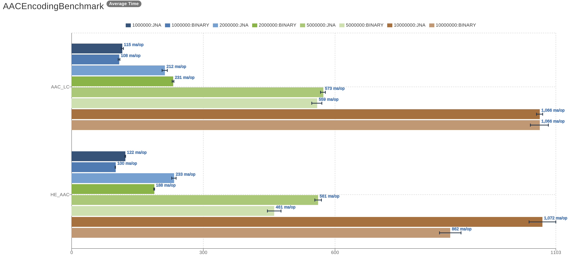

# jna-aac-encoder

[](https://travis-ci.org/sheinbergon/jna-aac-encoder) [](https://coveralls.io/github/sheinbergon/jna-aac-encoder) [](https://www.gnu.org/licenses/lgpl-3.0) 

                                                                                                                                                                                                                                                                                                 
This library provides AAC encoding capabilities for the JVM. 
It utilizes the [FDK AAC](https://github.com/mstorsjo/fdk-aac) library via JNA in order to do so.

## License
**Important!** While this library uses LGPL-3, please see
the [FDK AAC license](NOTICE) for additional information
regarding re/distribution and licensing limitations.

## Usage

### Dependencies
Artifacts are available on maven central:

**_Gradle_**
```groovy
compile 'org.sheinbergon:jna-aac-encoder:0.1.3'
```
**_Maven_**
```xml
<dependency>
    <groupId>org.sheinbergon</groupId>
    <artifactId>jna-aac-encoder</artifactId>
    <version>0.1.3</version>
</dependency>
```

#### Notice!!!
The **_libfdk-aac_** shared library so/dll/dylib file is required to be accessible
for dynamic loading upon execution. If using the above depdencey, you
need to make sure the shared library is installed as part of the runtime OS enviroment
and accessible to JNA. See [this](https://github.com/java-native-access/jna/blob/master/www/FrequentlyAskedQuestions.md#calling-nativeloadlibrary-causes-an-unsatisfiedlinkerror) link for additional information

To make things easier, cross-compiled artifacts (containing the shared library)
for both Windows(64bit) and Linux(64bit) are provided through the use of *_classifiers_*:

##### Windows(64 bit)
```groovy
compile 'org.sheinbergon:jna-aac-encoder:0.1.3:win32-x86-64'
```
##### Linux(64 bit)
```groovy
compile 'org.sheinbergon:jna-aac-encoder:0.1.3:linux-x86-64'
```
#### Additional information
* Provided fdk-aac version is 0.1.6
* This library was tested against 0.1.5/6
* 32bit platform won't be supported for now.
* OSX/Macos toolchain is a bit trickier, so you'll just have to pre-install the dylib in advance.

### Encoding using the JVM AudioSystem
```java
AudioInputStream input = AudioSystem.getAudioInputStream(...);
File output = new File(...);
AudioSystem.write(input, AACFileTypes.AAC_LC, output);
```

## Performance
Performance benchmarks comparing JNA to a BINARY application(`aac-enc`) are available using [JMH](http://openjdk.java.net/projects/code-tools/jmh/) and [JMH Visualizer](https://github.com/jzillmann/jmh-visualizer):



To run the benchmarks locally:
* Clone this repository to a Linux host
* Ensure that you have `libfdk-aac.so` library installed (either from an external repository or manually compiled) loadable
* Ensure that you have the `aac-enc` binary installed (either from an external repository or manually compiled)
* To execute the benchmark, run the following gradle command
```groovy
./gradlew -b perf.gradle jmh jmhReport
```
* If the aac-enc binary is not installed in /usr/bin/aac-enc, you can a custom path path by adding this gradle property:
```groovy
-PaacEncBin=/CUSTOM/PATH/TO/AAC-ENC 
```
* The JMH reports can be viewed by opening `build/reports/perf/index.html` in your browser.

## Limitations
Currently, only pcm_s16le WAV input is supported, meaning:
* Sample size - 16 bit(signed)
* WAV format - PCM
* Byte order - Little Endian

While this seems to be the common raw-audio formatting, it's important
to note that providing input audio with different formatting will cause
the encoding process to fail. 

Additional restrictions:
* A maximum of 6 audio input/output channels
* Only the AAC-LC/HE-AAC/HE-AACv2 encoding profiles are suuported  


## Roadmap
* Improved lower-level interface (with examples).
* Support additional WAV audio formats.
* Meta-data insertion.
* MacOS cross-compiling?
* AAC Decoding???